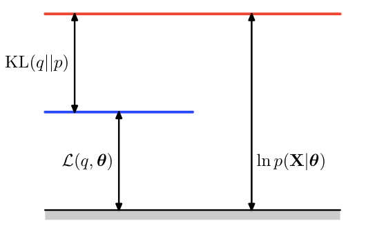
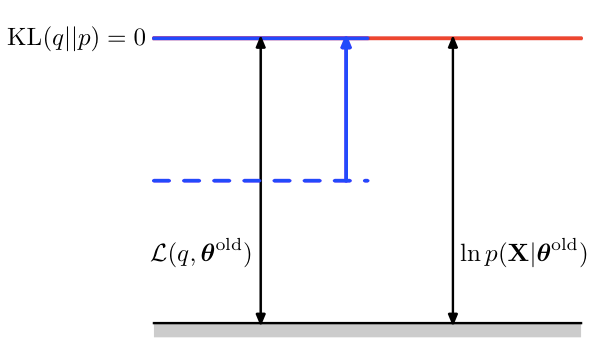

class: center, middle 

.master-title[
### Pattern Recognition and Machine Learning
### Chapter 9: Mixture Models and EM
]

.mtl[

by Shenghuai Ji

2014-11-13

]

---

# Menu
.mtl[
.highlight[
### 1. EM算法
### 2. EM算法的正确性
]
### 3. K-Means
### 4. 混合高斯模型
]

---

.center[
## EM算法
]
### 先由一个简单问题开始
* 现在有一个硬币，将它抛10次，得到8次正面朝上，2次正面朝下，求下一次抛这个硬币得到正面朝上的概率

---

.center[
## EM算法
]

### 先由一个简单问题开始
* 现在有一个硬币，将它抛10次，得到8次正面朝上，2次正面朝下，求下一次抛这个硬币得到正面朝上的概率

### 极大似然法
* 令抛一次硬币得到正面朝上的概率为p，则当前实验结果出现的概率为
$$ f(p) = p ^ 8 \* (1 - p) ^ 2 $$
$$ log f(p) = 8 \* logp \+ 2 \* log(1 - p) $$
* 求解得到
$$ p = argmax\ logf(p) = 0.8 $$

---

.center[
## EM算法
]

### 问题升级版
* 现在有三个硬币，分别标号为1、2、3，现在按照以下规则做10次试验并记录结果：

    1. 抛1号硬币
    2. 如果1号硬币正面朝上，则抛2号硬币，将2号硬币的结果作为本次试验的结果
    3. 如果1号硬币正面朝下，则抛3号硬币，将3号硬币的结果作为本次试验的结果

* 10次试验得到8次正面向上，2次正面向下
* 求下一次试验得到正面朝上的概率

---

.center[
## EM算法
]

### 难点
* 试验结果只有2号或者3号硬币的结果，1号硬币的结果是不可见的
* 1号硬币的结果称为__隐含变量__

### 定义
* 用变量Z来表示1号硬币的结果，Pz表示1号硬币正面朝上的概率
* 用变量X1来表示2号硬币的结果，Px1表示2号硬币正面朝上的概率
* 用变量X2来表示3号硬币的结果，Px2表示3号硬币正面朝上的概率
* 则一次试验正面朝上的概率为
$$ p\_z \* p\_{x1} \+ (1 - p\_z) \* p\_{x2} $$

---

.center[
## EM算法
]

### 极大似然法
* 则当前实验结果出现的概率为
$$ log f(p) = 8 \* log(p\_z \* p\_{x1} \+ (1 - p\_z) \* p\_{x2}) $$
$$ \+ \ 2 \* log(p\_z \* (1 - p\_{x1}) + (1 - p\_z) \* (1 - p\_{x2})) $$

### 存在问题
* log里面存在加号，无法直接通过导数为零求得最大值的参数的解析解
* EM就是用来解决这一类问题

---

.center[
## EM算法
]

### 一般定义
* 我们定义X作为我们要估算的那个事件
* 由于存在隐含变量，我们将其定义为Z
* P(X,Z) 表示隐含事件Z和可见事件X同时发生了的概率(比如例子中，第一个硬币得到了正面，这是变量Z，第二个硬币得到了反面，这是变量X，这个就叫做同时发生)
* P(X|Z) 表示隐含事件Z已经发生的前提下，事件X发生了的概率(比如例子中，第一个硬币得到了正面，这个时候我们只关注第二个硬币到底是正还是反，不关心第一个硬币的情况，因为我们已经知道它使得我们选择了第二个硬币)

---

.center[
## EM算法
]

### 一般定义
* 极大似然法
$$ \sum\_{n=1}^{N} lnP(x\_n) $$
* 同时我们有
$$ P(x\_n) = \sum\_{k=1}^{Z} P(x\_n, z\_k) $$
* 于是变成最大化
$$ \sum\_{n=1}^{N} ln \sum\_{k=1}^{Z} P(x\_n, z\_k) $$

---

.center[
## EM算法
]

### EM的算法前的部分定义
* 对于任意一个事件X，实际上都有一个对应的Z，我们把(X,Z)这样一个pair称之为完整数据，但在我们的问题中，是没办法得到Z的
* 对于当前的完整数据，它的Z必然是服从一个分布的，由于我们已经有X的数据，我们可以用X来算出这些事件发生下，Z的一个后验分布，即P(Z|X)，它的值可以这么得到
$$ P(z\_k|X) = \frac{P(z\_k)P(X|z\_k)}{\sum\_{j=1}^{Z} P(z\_j)P(X|z\_j)} $$
* 接着我们不直接求目标函数的最大值，转而求目标函数在P(Z|X)分布下的期望的最大值，即
$$ \sum\_{n=1}^{N} \sum\_{k=1}^{Z} P(z\_k|x\_n) lnP(x\_n, z\_k) $$

.small[
.center[
** 这样做的正确性会在下一节给出说明，为了叙述方便，本节不会说明这个做法的数学证明，现在暂且认为是对的 **
]
]

---

.center[
## EM算法
]

### EM算法的一般步骤
* 当目标函数变成期望的最大值后，ln里面的加法也不见了，此时就可以用求导导数为零的方法来求得一组目标最大化的参数，这就是EM的一轮迭代
* 由于迭代以后，模型参数发生了变化，意味着P(Z|X)也发生了变化，所以又重新计算P(Z|X)  
* 综上所述，我们可以得到EM的一般步骤
* E步
.center[
根据当前的参数计算P(Z|X)
]
* M步
$$ \theta = argmax\ \sum\_{n=1}^{N} \sum\_{k=1}^{Z} P(z\_k|x\_n)lnP(x\_n, z\_k) $$

* 不断重复迭代，直到收敛

---

.center[
## EM算法的正确性
]

### 两个角度的解释
* Jessen不等式
* Kullback-Leibler

---

.center[
## EM算法的正确性(Jessen不等式)
]

### Jessen不等式的内容
* 如果f是一个凸函数，X是随机变量，那么有
$$ E[f(X)] \geq f(E[X]) $$
* 如果是凹函数，那么有
$$ E[f(X)] \leq f(E[X]) $$
* 等号成立当且仅当
$$ P(X = E[X]) = 1 $$

---

.center[
## EM算法的正确性(Jessen不等式)
]

### 优化函数
$$ \sum\_{n=1}^{N} ln \sum\_{k=1}^{Z} P(x\_n, z\_k) = \sum\_{n=1}^{N} ln \sum\_{k=1}^{Z} Q\_n(z\_k) \frac{P(x\_n, z\_k)}{Q\_n(z\_k)} $$
设
$$ y\_{nk} = \frac{P(x\_n, z\_k)}{Q\_n(z\_k)} $$
由ln是凹函数，根据Jessen不等式得，
$$ \sum\_{n=1}^{N} ln\ E\_q[y\_n] \geq \sum\_{n=1}^{N} E\_q[ln\ y\_n] = \sum\_{n=1}^{N} \sum\_{k=1}^{Z} Q\_n(z\_k) ln \frac{P(x\_n, z\_k)}{Q\_n(z\_k)} $$
__于是我们可以得到原优化目标函数的一个下界__

---

.center[
## EM算法的正确性(Jessen不等式)
]

### 优化方法
* 于是我们可以得到这样一个策略：不断的调整参数使得它的下界上升，则目标函数也会跟着上升
* 同时，我们希望这个等号能够成立，当等号成立说明当前得到的这个值已经就是要优化的目标函数值了

---

.center[
## EM算法的正确性(Jessen不等式)
]

### 等号成立的方法
* 等号是否成立跟目标函数值是无关的，只跟Qn(zk)有关，考虑Jensen不等式的等号成立条件，我们可以得到
$$ \frac{P(x\_n, z\_k)}{Q(z\_k)} = c $$
* 由于Qn(zk)是Z的一个分布，则有
$$ \sum\_{k=1}^{Z} Q\_n(z\_k) = 1 \Longrightarrow \sum\_{k=1}^{Z} P(x\_n, z\_k) = c $$
$$ Q\_n(z\_k) = \frac{P(x\_n, z\_k)}{c} = \frac{P(x\_n, z\_k)}{\sum\_{k=1}^{Z} P(x\_n, z\_k)} = P(z\_k|x\_n) $$

---

.center[
## EM算法的正确性(Jessen不等式)
]

### 等式成立的方法
* 综上所述，当
$$ Q\_n(z\_k) = P(z\_k|x\_n) $$
Jesseon不等式的等号成立

### EM步骤
* E步
$$ Q\_n(z\_k) = P(z\_k|x\_n) $$
* M步
$$ \theta = argmax\ \sum\_{n=1}^{N} \sum\_{k=1}^{Z} Q\_n(z\_k)ln \frac{P(x\_n, z\_k)}{Q\_n(z\_k)} $$

---

.center[
## EM算法的正确性(Jessen不等式)
]

### 常数项舍弃
* 当我们把Qn(zk)=P(zk|xn)代入之后，由于Qn(zk)已经不变，我们可以把ln的分子作为常数，即
$$ \theta = argmax\ \sum\_{n=1}^{N} \sum\_{k=1}^{Z} P(z\_k|x\_n)lnP(x\_n, z\_k) - const $$
$$ = argmax \sum\_{n=1}^{N} \sum\_{k=1}^{Z} P(z\_k|x\_n)lnP(x\_n, z\_k) $$
* 这个时候就与上一节的优化目标一致了

---

.center[
## EM算法的正确性(Kullback–Leibler)
]

### 定义
* KL用于衡量两个概率分布之间的距离
$$ KL(Q||P) = -\int Q(x) ln \frac{P(x)}{Q(x)} $$
* 从最原始的优化目标出发，我们仿造上一节用一个Q表示Z的分布，则
$$ lnP(X) = \mathcal{L}(Q) + KL(Q||P) $$
其中
$$ \mathcal{L}(Q) = \sum\_{k=1}^{Z}Q(z\_k)ln \frac{P(X, z\_k)}{Q(z\_k)} $$ 
$$ KL(Q||P) = -\sum\_{k=1}^{Z} Q(z\_k) ln \frac{P(z\_k|X)}{Q(z\_k)} $$

---

.center[
## EM算法的正确性(Kullback–Leibler)
]

### 结论
* 由KL的定义有，KL(Q||P)大于等于零
* 等号成立当且仅当P = Q
* 实际上Jensen不等式跟Kullback–Leibler的角度的本质是一样的，那个不等号缺少的部分实际就是KL距离

### 进一步解释迭代对优化函数的影响
* 在每一次迭代中，E步首先令Q=P这个时候，对目标函数的值是没有影响的，因为只有参数θ才会改变目标函数的值，而Q只是我们假设出来的分布而已，E步的作用在于把下界提升，使得它跟当前的目标函数值相等。
* M步才是改变θ的，由于我们对当前这个下界求了最大值，必然的此时P和Q又不一样了，即KL>0，所以可以知道目标函数值也跟着上升了。

---

.center[
## EM算法的正确性(Kullback–Leibler)
]

### KL

---

.center[
## EM算法的正确性(Kullback–Leibler)
]

### E步

---

.center[
## EM算法的正确性(Kullback–Leibler)
]

### M步

.small[
__综上所述，EM的步骤就是不断提升下界，同时因为下界和目标函数值之间永远差了一个KL，所以也提升了目标函数值__
]

---

class: center, middle 
.master-title[
# Q & A
]

---

class: center, middle 

.master-title[
## Thanks
### Pattern Recognition and Machine Learning
### Chapter 9: Mixture Models and EM
]

.mtl[

by Shenghuai Ji

[http://jfantasy.github.io](http://jfantasy.github.io)

2014-11-13

]
