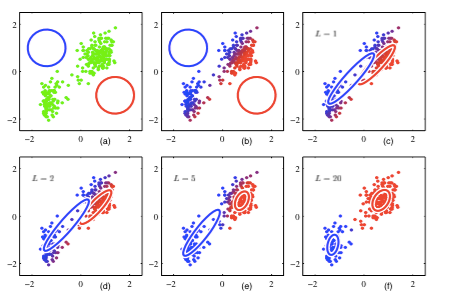
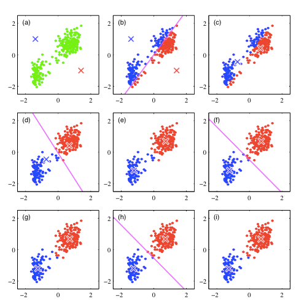

class: center, middle 

.master-title[
### Pattern Recognition and Machine Learning
### Chapter 9: Mixture Models and EM
]

.mtl[

by Shenghuai Ji

2014-11-13

]

---

# Menu
.mtl[
### 1. EM算法
### 2. EM算法的正确性
.highlight[
### 3. 混合高斯模型
### 4. K-Means
### 5. K-Means与混合高斯模型的关系
### 6. 书里其他内容
]
]

---

.center[
### 混合高斯模型
]

### 问题描述
* 已知现在有k个高斯模型
* 每一个高斯模型都有自己的均值、协方差矩阵
* 现在做N次试验，步骤如下
* 随便抽一个高斯模型，每一个高斯模型被抽中的概率不等
* 用这个高斯模型采样生成一个观测点，作为这次试验的结果
* 如果只有这N个点的观测结果和k，如何计算这k个高斯模型的均值、协方差矩阵以及抽中该模型的概率

---

.center[
### 混合高斯模型
]

### 问题定义
$$ P(x) = \sum\_{k=1}^{K} \pi\_k\mathcal{N}(x|\mu\_k, \Sigma\_k) $$
* 隐含变量z是一个K维01向量
$$ P(x, z) = P(z) * P(x|z) $$
$$ P(z\_k = 1) = \pi\_k $$
$$ constraints: \ 0 \leq \pi\_k \leq 1, \ \sum\_k \pi\_k = 1 $$
$$ P(z) = \prod\_k \pi\_k^{z\_k} $$

---

.center[
### 混合高斯模型
]

### 联合概率分布
$$ P(x|z\_k = 1) = \mathcal{N}(x|\mu\_k, \Sigma\_k) $$
$$ P(x|z) = \prod\_k \mathcal{N}(x|\mu\_k, \Sigma\_k)^{z\_k} $$
$$ P(x) = \sum\_k P(x, z) = \sum\_k P(z) * P(x|z) = \sum\_k \pi\_k \mathcal{N}(x|\mu\_k, \Sigma\_k) $$
$$ ln(X|\pi, \mu, \Sigma) = \sum\_{n=1}^N ln \sum\_k \pi\_k \mathcal{N}(x|\mu\_k, \Sigma\_k) $$

---

.center[
### 混合高斯模型
]

### 后验分布
$$ \gamma\_{kn} = P(z\_k = 1 | x\_n) = \frac{P(z\_k = 1) \* P(x\_n | z\_k = 1)}{\sum\_j P(z\_j = 1) \* P(x\_n |z\_j = 1)} $$
$$ = \frac{\pi\_k \mathcal{N}(x\_n |\mu\_k, \Sigma\_k)}{\sum\_j \pi\_j \mathcal{N}(x\_n |\mu\_j, \Sigma\_j)} $$

### 优化函数
$$ L = \sum\_n^N \sum\_k^K \gamma\_{kn} ln P(x\_n, z\_k) $$
$$ = \sum\_n^N \sum\_k^K \gamma\_{kn} ln \pi\_k \mathcal{N}(x\_n |\mu\_k, \Sigma\_k) $$

---

.center[
### 混合高斯模型
]

### 套用EM的公式
* E步: 根据当前的参数得到P(z|x)
* M步: 利用求导导数为零，调整参数

### 模型参数
$$ \pi, \mu, \Sigma $$

---

.center[
### 混合高斯模型
]

### 参数计算
$$ P(x\_n, z\_k) = \pi\_k \frac{1}{(2\pi)^{d/2}|\Sigma\_k|^{1/2}}e^{-\frac{1}{2}(x\_n - z\_k)^T \Sigma\_k^{-1} (x\_n - z\_k)} $$
$$ ln P(x\_n, z\_k) = -2 ln \pi\_k - ln |\Sigma\_k| - \(x\_n - z\_k)^T \Sigma\_k^{-1} (x\_n - z\_k) + const $$

---

.center[
### 混合高斯模型
]
### 参数计算
$$ L'(\mu\_k) = \sum\_n^N \gamma\_{kn} (x\_n - \mu\_k) = 0 $$
$$ \mu\_k = \frac{\sum\_n^N \gamma\_{kn} x\_n}{\sum\_n^N \gamma\_{kn}} $$

---

.center[
### 混合高斯模型
]
### 参数计算
$$ L(\pi\_k) = \sum\_n^N \gamma\_{kn} ln \pi\_k + \beta(\sum\_j^k \pi\_j - 1) $$
$$ L'(\pi\_k) = \sum\_n^N \frac{\gamma\_{kn}}{\pi\_k} + \beta $$
$$ \pi\_k = - \frac{\sum\_n^N \gamma\_{kn}}{\beta} $$
$$ \beta = N $$
$$ \Sigma\_k = \frac{\sum\_n^N \gamma\_{kn} (x\_n - \mu\_k)(x\_n - \mu\_k)^T}{\sum\_n^N \gamma\_{kn}} $$

---

.center[
### 混合高斯模型
]

### EM过程
* E步
$$ \gamma\_{kn} = \frac{\pi\_k \mathcal{N}(x\_n|\mu\_k, \Sigma\_k)}{\sum\_j \pi\_j \mathcal{N}(x\_n|\mu\_j, \Sigma\_j)} $$
* M步
$$ \mu\_k = \frac{\sum\_n^N \gamma\_{kn} x\_n}{\sum\_n^N \gamma\_{kn}} $$
$$ \pi\_k = - \frac{\sum\_n^N \gamma\_{kn}}{N} $$
$$ \Sigma\_k = \frac{\sum\_n^N \gamma\_{kn}(x\_n - \mu\_k)(x\_n - \mu\_k)^T}{\sum\_n^N \gamma\_{kn}} $$

---

.center[
### K-Means
]

### 问题定义
* 有N个观测点x1, x2, ... xn
* 要划分成K个类
* 聚类中心 uk

### 数学表达
$$ r\_{nk} \in \lbrace 0, 1 \rbrace $$
$$ r\_{nk} = 1, and \ r\_{nj} = 0 \ for \ j \neq k $$
$$ J = \sum\_n^N \sum\_k^K r\_{nk} ||x\_n - \mu\_k||^2 $$

---

.center[
### K-Means
]

### 迭代过程
* 保持uk不变，计算rnk
$$ r\_{nk} = 1 \ if \ k = argmin\_j||x\_n - \mu\_k||^2 \ else \ 0 $$

* 调整uk
$$ J' = 2 \sum\_n^N r\_{nk}(x\_n - \mu\_k) = 0 $$
$$ \mu\_k = \frac{\sum\_n r\_{nk} x\_n}{\sum\_n r\_{nk}} $$

---

.center[
### K-Means与混合高斯模型的EM算法的联系
]

### 结论
* K-Means是混合高斯模型的EM算法的一个特例
* 多了一个条件：每个点必须有且仅有属于一个类

### 解释
$$ 首先把高斯混合模型中的协方差矩阵变成单位矩阵\epsilon I $$
$$ p(x\_n | \mu\_k, \Sigma\_k) = \frac{1}{(2 \pi \epsilon)^{1/2}} e^{-\frac{1}{2 \epsilon} ||x\_n - \mu\_k||^2} $$
$$ \gamma\_{kn} = \frac{\pi\_k exp \lbrace -||x\_n - \mu\_k||^2 / 2 \epsilon \rbrace}{\sum\_j \pi\_j exp \lbrace -||x\_n - \mu\_j||^2 / 2 \epsilon \rbrace} $$
$$ 当lim\_{\epsilon \rightarrow 0}, \gamma\_{kn} = r\_{nk} $$

---

.center[
### K-Means与混合高斯模型的EM算法的联系
]

### 解释
$$ 再把\pi\_k设置为等概率，即\frac{1}{k}，此时\pi变成常数 $$
$$ ln P(x\_n, z\_k) = -2 ln \pi\_k - ln |\Sigma\_k| - \(x\_n - z\_k)^T \Sigma\_k^{-1} (x\_n - z\_k) + const $$
* 舍弃常数项得
$$ ln P(x\_n, z\_k) = -||x\_n - z\_k||^2 $$
* 目标函数
$$ J = \sum\_n \sum\_k \gamma\_{nk} lnP(x\_n, z\_k) = -\sum\_n \sum\_k r\_{nk} ||x\_n - \mu\_k||^2 + const $$
* __此时K-Means与混合高斯模型的EM算法统一起来了__ 

---

.center[
### K-Means与混合高斯模型的EM算法的联系
]
### GMM流程

---

.center[
### K-Means与混合高斯模型的EM算法的联系
]
### K-Means流程

---

.center[
### K-Means与混合高斯模型的EM算法的联系
]

### 其他结论
* 一般来说，GMM需要比K-Means迭代更多轮
* K-Means的结果可以作为GMM的初始化参数

---

.center[
### 书里其他内容
]

### 在线的K-Means
$$ \mu\_k^{new} = \mu\_k^{old} + \eta\_n (x\_n - \mu\_k^{old}) $$

### 其他混合模型
* 混合Bermoulli模型
* 贝叶斯线性回归的EM方法

---

class: center, middle 

.master-title[
## Thanks
### Pattern Recognition and Machine Learning
### Chapter 9: Mixture Models and EM
]

.mtl[

by Shenghuai Ji

[http://jfantasy.github.io](http://jfantasy.github.io)

2014-11-13

]
